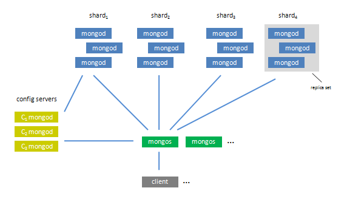

!SLIDE bullets

# Agenda #

* About MongoDB
* Using MongoDB
* Using MongoDB with Ruby
* Scaling Out
* The Dark Side of MongoDB

!SLIDE bullets incremental

# Scaling Out #

* Replication
* Auto-Sharding

!SLIDE bullets incremental

# Replication #

* Not really scaling
* Master/Slave replication
* Like MySQL

!SLIDE bullets incremental

# Replication #

* Writes go to a master
* Reads go to a slave

!SLIDE bullets incremental

# Sharding #

* Now that's more like it

!SLIDE bullets incremental

# Sharding #

* Partition data
* Distribute it across nodes

!SLIDE center

# Sharding #

